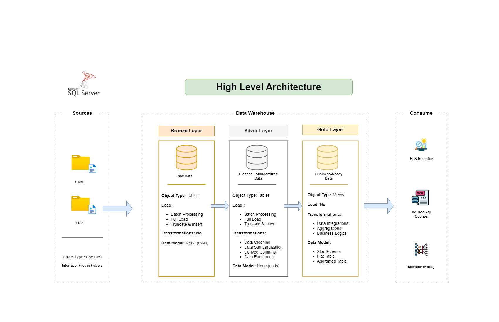
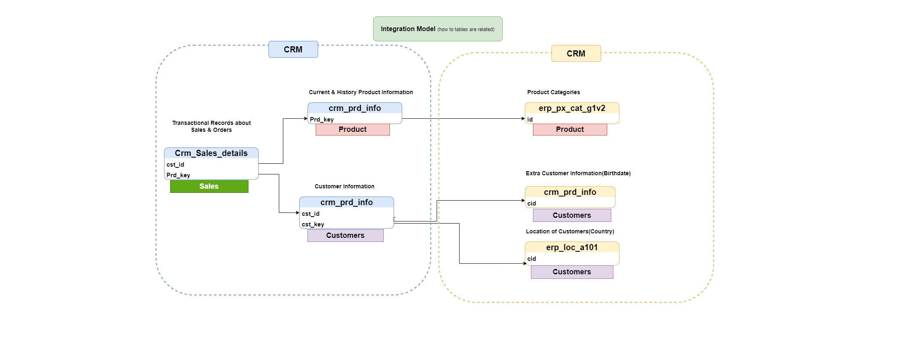
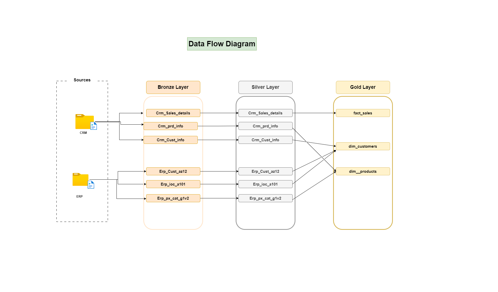

# Data Warehouse & Analytics Project

Welcome to the **Data Warehouse and Analytics Project** repository!  
This project demonstrates a comprehensive data warehousing and analytics solution, from building a data warehouse to generating actionable insights. Designed as a portfolio project, it highlights industry best practices in data engineering and analytics.

---

## Project Requirements

### **Building the Data Warehouse (Data Engineering)**

#### **Objective**
Develop a modern data warehouse using SQL Server to consolidate sales data, enabling analytical reporting and informed decision-making.

#### **Specifications**
- **Data Sources**: Import data from two source systems (ERP and CRM) provided as CSV files.
- **Data Quality**: Cleanse and resolve data quality issues prior to analysis.
- **Integration**: Combine both sources into a single, user-friendly data model designed for analytical queries.
- **Scope**: Focus on the latest dataset only; historization of data is not required.
- **Documentation**: Provide clear documentation of the data model to support both business stakeholders and analytics teams.

---

### **BI: Analytics & Reporting (Data Analytics)**

#### **Objective**
Develop SQL-based analytics to deliver detailed insights into:
- **Customer Behavior**
- **Product Performance**
- **Sales Trends**

These insights empower stakeholders with key business metrics, enabling strategic decision-making.

---
# Data Architecture
The data architecture for this project follows Medallion Architecture Bronze, Silver, and Gold layers.





1. **Bronze Layer**: Stores raw data as-is from the source systems. Data is ingested from CSV Files into SQL Server
Database.
2. **Silver Layer**: This layer includes data cleansing, standardization, and normalization processes to prepare data for
analysis.
3. **Gold Layer**: Houses business-ready data modeled into a star schema required for reporting and analytics.
-----
# Integration Model (how to tables are related)
This integration model helps in linking Sales, Customer, and Product data for better analysis and business intelligence.




- **This Integration Model illustrates the relationships between Sales, Products, and Customers in a CRM and ERP system.**
 Sales transactions (Crm_Sales_details) link to Product Information (crm_prd_info) and Customer Details (crm_prd_info & erp_loc_a101). 
Additionally, products are categorized in erp_px_cat_g1v2, while customer location and extra details like birthdates are stored in related tables for enhanced business analysis.
------

# Data Flow Diagram illustrates a structured ETL pipeline with three layers





This Data Flow Diagram illustrates a structured ETL pipeline with three layers: Bronze, Silver, and Gold. Data is ingested from CRM and ERP sources into the Bronze layer, then refined and standardized in the Silver layer before being transformed into fact_sales, dim_customers, and dim_products in the Gold layer. The Gold layer serves as the final analytics-ready model for business intelligence and reporting.
## Repository Structure
```
data_warehouse_project/
├── data/ # Contains raw data files (ERP and CRM CSV files)
├── scripts/ # SQL scripts for data warehousing and analytics
├── documentation/ # Documentation for the data model and project
├── README.md # Project overview and instructions
└── reports/ # Generated reports and visualizations
```

---

## Getting Started

### Prerequisites
- SQL Server (or any compatible database system)
- CSV files for ERP and CRM data
- Basic understanding of SQL and data modeling

### Steps to Build the Data Warehouse
1. **Import Data**: Load the ERP and CRM CSV files into SQL Server.
2. **Data Cleansing**: Resolve data quality issues (e.g., missing values, duplicates).
3. **Data Integration**: Combine ERP and CRM data into a unified data model.
4. **Data Modeling**: Design a star schema or snowflake schema optimized for analytical queries.
5. **Documentation**: Document the data model and ETL process for stakeholders.

### Steps for Analytics & Reporting
1. **Customer Behavior Analysis**: Write SQL queries to analyze customer purchase patterns.
2. **Product Performance Analysis**: Identify top-performing products and trends.
3. **Sales Trends Analysis**: Generate insights into sales performance over time.
4. **Reporting**: Create dashboards or reports to visualize key metrics.

---

## Documentation
Refer to the documentatio nfolder for detailed information on:
- Data model design
- ETL process
- SQL queries for analytics
- Report generation

---

## Contributing
Contributions are welcome! If you'd like to improve this project, please follow these steps:
1. Fork the repository.
2. Create a new branch for your feature or bug fix.
3. Submit a pull request with a detailed description of your changes.

---

## License
This project is licensed under the MIT License. See the [LICENSE](LICENSE) file for details.

---

## Contact
For questions or feedback, please reach out to Ahmed Hegazy at ahmed.a.hegazy21@gmail.com .

